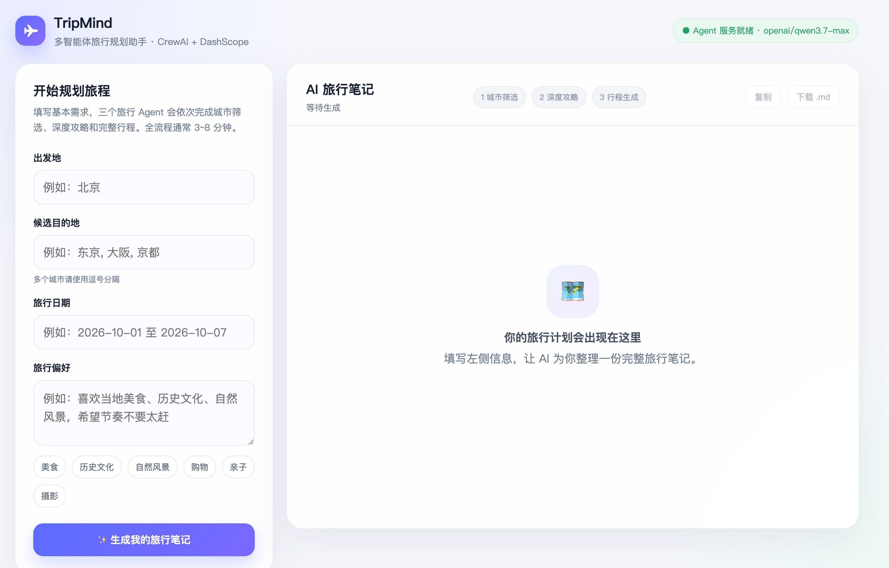
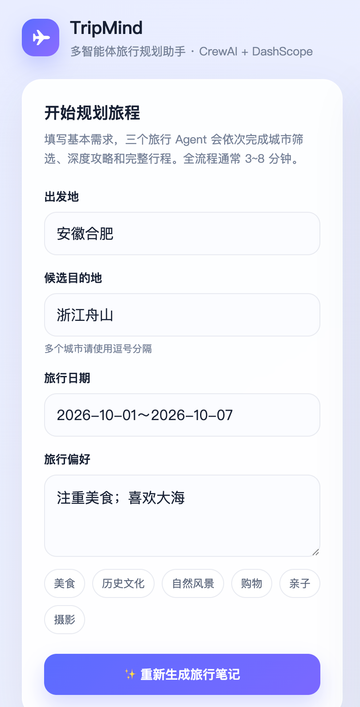
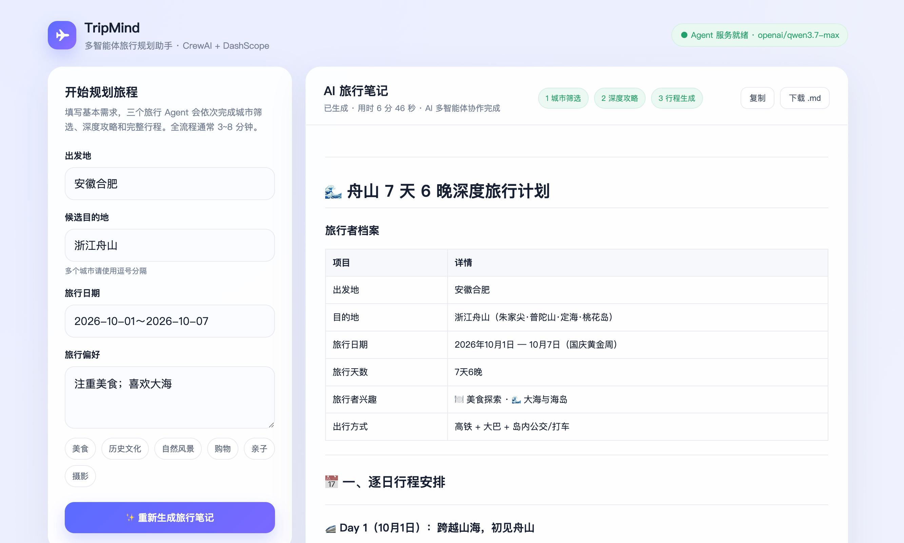

# 用 CrewAI 搭旅行规划多智能体实战案例

这个项目用 CrewAI 搭了三个 Agent 做旅行规划：一个从候选城市里挑目的地，一个写当地深度攻略，一个排逐日行程和预算。三个任务顺序执行，前一个的产出会自动进后一个的上下文。

模型走 DashScope（通义千问），搜索用 Tavily，网页抓取用 requests + BeautifulSoup。除了 CLI，还配了一层 Flask 服务和一页前端：浏览器里填表提交，进度实时显示，跑完把结果渲染成 Markdown 行程，能复制、能下载。

## 一、三个 Agent 的分工和接力

Crew 是顺序执行的（Process.sequential，CrewAI 的默认值）：三个 Task 排队跑，前一个 Task 的输出自动进入后一个 Task 的上下文，不需要手写 context 参数。

```
输入（CLI 或 Web UI）
   │
   ▼
① 城市选择专家   从候选城市里选出目的地，给出天气、价格、景点报告
② 当地城市专家   产出目的地深度攻略，重点是本地人玩法
③ 金牌旅行管家   产出 7 日逐日行程、预算明细、行李建议
   │
   ▼
CLI：终端打印最终结果，逐步保存到 output/latest/
Web：task_callback 回传进度，完成后渲染到浏览器
```

三个 Agent 共用三类工具：

- `SearchTools.search_internet`：Tavily 联网搜索，一次取前 4 条结果
- `BrowserTools.scrape_and_summarize_website`：抓网页正文，再交给一个"首席研究员" Agent 做中文总结
- `CalculatorTools.calculate`：ast 白名单解析的表达式计算，只有旅行管家配了它，预算运算走工具而不是让模型心算

Agent 和 Task 的定义在 `trip_agents.py` 和 `trip_tasks.py`。每个任务描述末尾都带一句小费提示：

```python
def __tip_section(self):
    return "如果你做到最好，我会给你 100 美元小费！"
```

## 二、目录结构

```
trip_planner/
├── main.py              # CLI 入口：收集输入 → 组建 Crew → kickoff()
├── server.py            # Flask Web 服务：托管 UI + 异步 job API
├── trip_agents.py       # 3 个 Agent 的角色 / 目标 / 工具
├── trip_tasks.py        # 3 个 Task 的描述 / 预期产出
├── llm_config.py        # LLM 与环境配置：加载 .env、绕过代理
├── requirements.txt     # 依赖清单
├── .env.example         # 密钥清单模板
├── ui/
│   └── index.html       # 前端 UI（原生 HTML/CSS/JS + marked.js）
├── output/              # 运行产出与案例截图
│   ├── img.png          # 手机端已填表截图
│   ├── img_1.png        # 桌面端生成完成截图
│   ├── img_2.png        # 初始空态截图
│   ├── trip_plan_*.md   # Web 端下载的最终行程
│   └── latest/          # CLI 运行后生成（step1~3 + meta.json）
└── tools/
    ├── __init__.py
    ├── search_tools.py      # Tavily 搜索
    ├── browser_tools.py     # requests + BeautifulSoup 抓取并总结
    └── calculator_tools.py  # 安全的数学表达式计算
```

## 三、四处配置：模型、搜索、抓取、环境加载

先放总表：

| 位置 | 方案 | 说明 |
|------|------|------|
| LLM | DashScope / 通义千问 | 已有 `DASHSCOPE_API_KEY` |
| 搜索工具 | Tavily | 已有 `TAVILY_API_KEY` |
| 网页抓取 | requests + BeautifulSoup | 去噪后截 8000 字总结 |
| 环境加载 | 仓库根目录绝对路径 | `NO_PROXY=*` 绕过本地代理 |

下面逐项说。

### 3.1 模型：DashScope / 通义千问

CrewAI 的 Agent 不传 `llm` 时会走默认的 OpenAI。DashScope 提供 OpenAI 兼容接口，构造一个带 `api_base` 的 LLM 实例传进去就行：

```python
DASHSCOPE_BASE_URL = "https://dashscope.aliyuncs.com/compatible-mode/v1"

def get_llm(temperature: float = 0.7) -> LLM:
    return LLM(
        model=DEFAULT_MODEL,
        api_key=os.getenv("DASHSCOPE_API_KEY"),
        api_base=DASHSCOPE_BASE_URL,
        temperature=temperature,
    )
```

默认模型是 `openai/qwen3.7-max`，可用环境变量 `CREWAI_MODEL` 覆盖，比如 `CREWAI_MODEL=openai/qwen-plus`。三个 Agent 各自调 `get_llm()` 取实例。

### 3.2 搜索：Tavily

搜索工具走 Tavily 的 search 接口，返回"标题 / 链接 / 摘要"三段式，取前 4 条：

```python
top_result_to_return = 4
url = "https://api.tavily.com/search"
payload = {"api_key": api_key, "query": query, "max_results": top_result_to_return}
```

### 3.3 网页抓取：requests + BeautifulSoup

requests 拿 HTML，去掉 script、style、nav、footer、header 这些噪声标签取正文，截前 8000 字交给一个独立 Agent 总结：

```python
for tag in soup(["script", "style", "nav", "footer", "header", "noscript"]):
    tag.decompose()
text = soup.get_text(separator="\n")
...
f"网页内容\n----------\n{text[:8000]}"
```

这里用到一个 CrewAI 的细节：Task 不挂到 Crew 上也能单独 `task.execute()`，适合这种一次性的总结场景。

### 3.4 环境加载：仓库根目录 .env

密钥统一放在仓库根目录的 `.env`，脚本在两层子目录之下，直接按文件位置往上定位：

```python
PROJECT_ROOT = Path(__file__).resolve().parents[2]
load_dotenv(PROJECT_ROOT / ".env", override=True)
os.environ["NO_PROXY"] = "*"
```

`NO_PROXY` 这行在本机是必须的：开着代理调 DashScope 会遇到 `RemoteDisconnected`，绕过之后直连正常。

这几件事都写在 `llm_config.py` 的模块顶层，谁先 import 它，谁就完成环境注入。`trip_agents.py` 和 `browser_tools.py` 都从它取 `get_llm()`。

## 四、Web 化：异步 job + 进度回调

### 4.1 为什么不走同步接口

一次完整执行 3 到 8 分钟：三个 Agent 串行，中间夹着多次 LLM 调用和联网请求。同步 HTTP 撑不住这个时长，浏览器和反向代理默认几十秒就断。

`server.py` 的做法是接了活立刻返回，进度靠前端轮询：

```python
job_id = _new_job()
thread = threading.Thread(
    target=_run_crew,
    args=(job_id, origin, cities, date_range, interests),
    name=f"trip-crew-{job_id}",
    daemon=True,
)
thread.start()
return jsonify({"success": True, "job_id": job_id})
```

job 存在进程内的 `JOBS` 字典里，读写用 `threading.Lock` 包住，读取时深拷贝一份快照，避免前端读到一半被后台线程改掉。平时自己跑够用；要上生产把 `JOBS` 换成 Redis 或数据库即可，其余逻辑不用动。

### 4.2 task_callback 把进度送到前端

`Crew` 的构造器接受 `task_callback`，每完成一个 Task 回调一次。`main.py` 里把它透传下去：

```python
crew = Crew(
    agents=[
        city_selector_agent,
        local_expert_agent,
        travel_concierge_agent,
    ],
    tasks=[identify_task, gather_task, plan_task],
    verbose=verbose,
    task_callback=task_callback,
)

result = crew.kickoff()
```

server 侧的回调逻辑（省去锁和判空，完整实现见 `server.py`）：

```python
def _on_task_done(output):
    idx = completed["count"]
    raw = getattr(output, "raw", None) or str(output)
    # 当前步骤标 done，下一步骤标 active，输出截前 4000 字
    job["steps"][idx]["status"] = "done"
    job["steps"][idx]["output"] = raw[:4000]
    if idx + 1 < len(job["steps"]):
        job["steps"][idx + 1]["status"] = "active"
    completed["count"] += 1
```

前端两个消费点：顶部"1 城市筛选 / 2 深度攻略 / 3 行程生成"三个胶囊随状态变色（灰 / 蓝 / 绿），"Agent 中间产出"面板展开能看每一步的原文，进度轮询每 2 秒一次。页面本身没有构建步骤，纯 HTML/CSS/JS 由 Flask 托管，Markdown 渲染走 CDN 上的 marked.js，CDN 拿不到就降级成纯文本。

### 4.3 注意事项

1. `use_reloader=False` 要默认关掉。Flask 的 reloader 会 fork 子进程，后台线程跑到一半被杀。需要热重载就显式加 `--debug`，代价是改代码会中断进行中的任务。
2. `llm_config` 要最先 import。`server.py` 顶部先 `import llm_config` 触发 `.env` 加载和 `NO_PROXY` 注入，再 `import main`，否则 `trip_agents`、`tools` 拿到的环境是不完整的。这一行看着多余，删了子模块就读不到密钥。
3. 结果落盘和浏览器下载是两条路。任务完成时把 Markdown 写一份到 `trip_plan.md` 方便命令行查看；下载走 `/api/plan/<job_id>/md`，直接从内存 job 出流，不依赖磁盘。

### 4.4 接口一览

| Method | Path | 说明 |
|--------|------|------|
| GET | `/` | 前端 UI |
| GET | `/api/health` | 健康检查，返回密钥配置情况和当前模型 |
| POST | `/api/plan` | 创建任务，请求体 `{origin, cities, date_range, interests}`，返回 `{job_id}` |
| GET | `/api/plan/<job_id>` | 轮询任务状态、各步输出、最终 Markdown |
| GET | `/api/plan/<job_id>/md` | 下载最终 Markdown 文件 |

不想开浏览器也可以直接 curl：

```bash
curl -X POST http://127.0.0.1:8000/api/plan \
  -H 'Content-Type: application/json' \
  -d '{"origin":"北京","cities":"东京,大阪","date_range":"10.1-10.7","interests":"美食,购物"}'
# => {"success":true,"job_id":"xxxxxxxxxxxx"}
```

## 五、跑起来

### 5.1 准备密钥和依赖

仓库根目录的 `.env` 里要有两个 key，本项目会自动读取：

```
DASHSCOPE_API_KEY=你的通义千问密钥
TAVILY_API_KEY=你的Tavily密钥
```

安装依赖：

```bash
conda run -n LangChainCode pip install -r crewai-ai/trip_planner/requirements.txt
```

已经激活环境的话，直接 `pip install -r requirements.txt` 也行。依赖只有 6 个：crewai、python-dotenv、requests、beautifulsoup4、httpx[socks]、Flask。

zsh 用户先注意一点：交互会话默认不把 `#` 当行内注释，带 `# 说明` 的命令行整段粘贴时，井号后面的内容会被当成参数传下去，报 `Invalid requirement: '#'` 这种莫名其妙的错。别整段抄带注释的命令，或者执行 `setopt interactive_comments` 一次解决。

### 5.2 Web 模式

先 cd 进项目目录，代码里用的是 `from tools...` 这种导入，目录不对会直接报导入错误：

```bash
cd crewai-ai/trip_planner
conda activate LangChainCode
python server.py
```

默认监听 <http://127.0.0.1:8000>，换端口或对外访问：

```bash
python server.py --host 0.0.0.0 --port 8080
```

端口没用 Flask 习惯的 5000，因为 macOS Monterey 之后的 AirPlay Receiver 占着 5000 和 7000。表现有两种：报 `Address already in use`，或者启动看着成功、浏览器打开却返回 403（实际命中的是 AirPlay）。`lsof -i :5000` 看到 `ControlCe` 就是它。要么换端口（默认已经换成 8000），要么去系统偏好设置的"隔空投送与接力"里关掉 AirPlay 接收端。

打开页面后：左侧填出发地、候选目的地、日期范围、旅行偏好，点"生成我的旅行笔记"；顶部胶囊随进度点亮；展开"Agent 中间产出"看每步原始输出；跑完右侧渲染 Markdown，可复制、可下载 `.md`。

### 5.3 CLI 两种跑法

交互式要真终端，`conda run python main.py` 不转发 stdin，`input()` 直接抛 `EOFError`：

```bash
conda activate LangChainCode
python main.py
```

带参数跑，适合脚本和 IDE：

```bash
conda run --no-capture-output -n LangChainCode python main.py \
    --origin 北京 --cities "东京,大阪" \
    --date-range "10.1-10.7" --interests 美食,购物
```

`--no-capture-output` 别省。`conda run` 默认捕获子进程 stdout，CrewAI 的 `verbose` 日志不实时输出，终端好几分钟不滚一行，看起来像卡死，实际在正常跑。更省事的是用环境的 python 直连，日志实时刷：

```bash
/Users/zhangyu/miniconda3/envs/LangChainCode/bin/python main.py ...
```

CLI 的产出在 `output/latest/` 下：`step1_city_selection.md`、`step2_local_guide.md`、`step3_trip_plan.md` 分别对应三个 Agent 的产出，外加一份 `meta.json` 记录当次输入，每次运行覆盖上一轮。

## 六、演示

### 6.1 输入与结果

- 出发地：安徽合肥
- 候选目的地：浙江舟山
- 日期：2026-10-01 至 2026-10-07
- 偏好：注重美食、喜欢大海

三个 Agent 串行跑了 6 分 46 秒，产出一份 416 行的《舟山 7 天 6 晚深度旅行计划》，文件在 `output/trip_plan_4db56a578da3.md`。

### 6.2 过程

| 阶段 | 说明 | 截图 |
|------|------|------|
| 初始空态 | 服务就绪，笔记区等待生成，三个胶囊是灰的 |  |
| 已填表 | 手机端窄屏自动折成单列，按钮变成"重新生成旅行笔记" |  |
| 生成完成 | 三个胶囊全绿，元信息显示"已生成 · 用时 6 分 46 秒 · AI 多智能体协作完成" |  |

### 6.3 产出节选（以实际输出为准）

````markdown
# 🌊 舟山 7 天 6 晚深度旅行计划

### **旅行者档案**
| 项目 | 详情 |
|------|------|
| 出发地 | 安徽合肥 |
| 目的地 | 浙江舟山（朱家尖·普陀山·定海·桃花岛） |
| 旅行日期 | 2026年10月1日 — 10月7日（国庆黄金周） |
| 旅行天数 | 7天6晚 |
| 旅行者兴趣 | 🍽️ 美食探索 · 🌊 大海与海岛 |
| 出行方式 | 高铁 + 大巴 + 岛内公交/打车 |

## 📅 一、逐日行程安排

### 🚄 Day 1（10月1日）：跨越山海，初见舟山

| 时间 | 安排 | 详情 |
|------|------|------|
| 07:00 | 🚄 合肥南站出发 | 乘坐 G7693 或同班次高铁前往宁波站，车程约3.5-4小时，二等座 **275元**。国庆首日车票极度紧张，**务必提前15天抢票**！ |
| 11:00 | 🚌 宁波汽车南站换乘 | 出站后按指示牌步行至紧邻的宁波汽车南站（无缝衔接），购买前往舟山朱家尖的大巴票，**75元/人**，车程约2小时，走舟山跨海大桥。 |
| 15:00 | 🚶 南沙沙滩漫步 | 步行前往**朱家尖南沙沙滩**（门票约75元），这是舟山最大的沙滩，沙质细腻。初次踏浪，感受东海的咸湿海风，消除旅途疲劳。 |

#### 🏨 住宿推荐：朱家尖「海山生活·南沙精品民宿」
- **价格**：国庆期间约 **700-900元/晚**（大床房）
- **为什么选它**：步行5分钟即达南沙沙滩，老板是本地渔民，可以帮忙加工海鲜。房间有海景阳台，清晨可以听到海浪声。民宿风格融合了渔村元素与现代设计，拍照极出片。
````

几个细节：

- 逐日安排是"时间 / 安排 / 详情"三列的表，日程可以直接抄进手机日历
- 数字是真实检索来的：高铁 275 元、大巴 75 元、民宿 700-900 元/晚，来自 Tavily 搜索加管家用计算器汇总
- "筲箕湾渔村""普济禅寺素斋"这类本地玩法出现在最终行程里，说明当地专家 Task 的输出确实传给了管家 Task
- 每日行程后穿插 `> Day N 贴士` 引用块，比如 Day 5 提醒"提前查好返程末班船时间"，购物部分还有"称重时注意电子秤是否归零"

### 6.4 复现

```bash
cd crewai-ai/trip_planner
conda activate LangChainCode
python server.py
```

打开 <http://127.0.0.1:8000>，按 6.1 的输入填表，点生成，等 3 到 8 分钟，完成后点"下载 .md"。

## 七、扩展

- `verbose=True` 会把每个 Agent 的思考和工具调用打到终端，想看协作细节就开着
- 任务之间是接力式的：前一个 Task 的输出自动进后一个的上下文，"选城市 → 攒攻略 → 排行程"的衔接不用手写 `context`
- 换模型：设置 `CREWAI_MODEL`，比如 `CREWAI_MODEL=openai/qwen-plus`（默认 `openai/qwen3.7-max`）
- 多用户或持久化：把 `server.py` 里的 `JOBS` 换成 Redis 或数据库，其余逻辑不用动

---

看完想动手的话，先读 `trip_tasks.py`（任务怎么定义）和 `server.py`（怎么调度），这两个文件读通，剩下的都是细节。

- 仓库地址：<https://github.com/zwzhangyu/ai-agent-lab>
- 项目目录：`crewai-ai/trip_planner`
